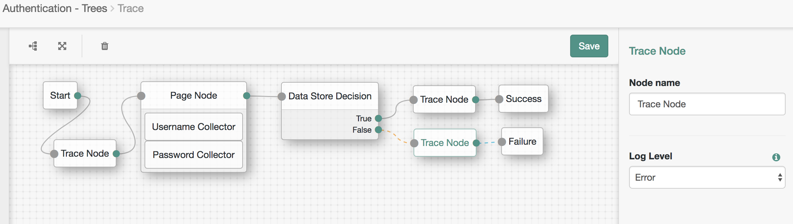
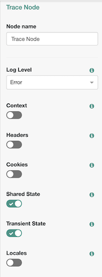

<!--
 * The contents of this file are subject to the terms of the Common Development and
 * Distribution License (the License). You may not use this file except in compliance with the
 * License.
 *
 * You can obtain a copy of the License at legal/CDDLv1.0.txt. See the License for the
 * specific language governing permission and limitations under the License.
 *
 * When distributing Covered Software, include this CDDL Header Notice in each file and include
 * the License file at legal/CDDLv1.0.txt. If applicable, add the following below the CDDL
 * Header, with the fields enclosed by brackets [] replaced by your own identifying
 * information: "Portions copyright [year] [name of copyright owner]".
 *
 * Copyright ${data.get('yyyy')} ForgeRock AS.
-->
# Trace Header Context Session Node

**DESCRIPTION**

A utility authentication node for [Forgerock's Identity Platform](https://www.forgerock.com/platform/) 6.0 and above.

+ This node prints context, header, session, cookies, callbacks, locales, and client IP information

**BUILD INSTRUCTIONS**

Navigate to the source directory.  Run Maven to build:

    $ mvn clean install

*Note: The code in this repository has binary dependencies that live in the ForgeRock maven repository. Maven can be configured to authenticate to this repository by following the following [ForgeRock Knowledge Base Article](https://backstage.forgerock.com/knowledge/kb/article/a74096897).*

**INSTALLATION**

+ Copy the .jar file from the ../target directory into the ../web-container/webapps/openam/WEB-INF/lib directory where AM is deployed.

+ Restart the web container to pick up the new node.  The node will then appear in the authentication trees components palette.

**USAGE**

+ Multiple instaces of the node can be inserted between any nodes in a tree to get the current values of context, header, session, cookies, callbacks, locales, and client IP.

+ Configuration 
    + The only configuration option is the log level to write to the debug log file.

**SCREENSHOT**

+ This node is a single output node which may be placed in-line with any other nodes. 

+ Note: From version 6.5.2.2 (internal number not refleted in the jar name), it is possible to toggle on/off which individal data sets returned.

**SAMPLE OUTPUT**

    TraceHeaderContextSessionNode:08/02/2018 07:03:16:558 PM UTC: Thread[http-nio-18080-exec-7,5,main]: TransactionId[75b21e6a-b8db-47b4-b44d-d4574bc5fe2a-1396]
    ERROR: [TraceHeaderContextSessionNode] : *** CONTEXT ***
    org.forgerock.openam.auth.node.api.TreeContext@3609df13
    TraceHeaderContextSessionNode:08/02/2018 07:03:16:559 PM UTC: Thread[http-nio-18080-exec-7,5,main]: TransactionId[75b21e6a-b8db-47b4-b44d-d4574bc5fe2a-1396]
    ERROR: [TraceHeaderContextSessionNode] : *** HEADERS ***
    {accept=[application/json, text/javascript, */*; q=0.01], accept-api-version=[protocol=1.0,resource=2.1], accept-encoding=[gzip, deflate, br], accept-language=[en-US], cache-control=[no-cache], connection=[Keep-Alive], content-length=[2119], content-type=[application/json], cookie=[i18next=en-us; amlbcookie=01], host=[test.forgerockdemo.com], origin=[https://test.forgerockdemo.com], referer=[https://test.forgerockdemo.com/openam/XUI/?service=Trace], user-agent=[Mozilla/5.0 (Macintosh; Intel Mac OS X 10_13_2) AppleWebKit/537.36 (KHTML, like Gecko) Chrome/67.0.3396.87 Safari/537.36 OPR/54.0.2952.64], x-forwarded-for=[74.104.191.74], x-forwarded-host=[test.forgerockdemo.com], x-forwarded-server=[test.forgerockdemo.com], x-nosession=[true], x-password=[anonymous], x-requested-with=[XMLHttpRequest], x-username=[anonymous]}
    TraceHeaderContextSessionNode:08/02/2018 07:03:16:559 PM UTC: Thread[http-nio-18080-exec-7,5,main]: TransactionId[75b21e6a-b8db-47b4-b44d-d4574bc5fe2a-1396]
    ERROR: [TraceHeaderContextSessionNode] : *** COOKIES ***
    {i18next=en-us, amlbcookie=01}
    TraceHeaderContextSessionNode:08/02/2018 07:03:16:560 PM UTC: Thread[http-nio-18080-exec-7,5,main]: TransactionId[75b21e6a-b8db-47b4-b44d-d4574bc5fe2a-1396]
    ERROR: [TraceHeaderContextSessionNode] : *** SHARED_STATE ***
    { "realm": "/", "authLevel": 0, "pageNodeCallbacks": { "0": 0, "1": 1 }, "username": "bjensen" }
    TraceHeaderContextSessionNode:08/02/2018 07:03:16:560 PM UTC: Thread[http-nio-18080-exec-7,5,main]: TransactionId[75b21e6a-b8db-47b4-b44d-d4574bc5fe2a-1396]
    ERROR: [TraceHeaderContextSessionNode] : *** LOCALES ***
    org.forgerock.util.i18n.PreferredLocales@5d22fc10
    TraceHeaderContextSessionNode:08/02/2018 07:03:16:560 PM UTC: Thread[http-nio-18080-exec-7,5,main]: TransactionId[75b21e6a-b8db-47b4-b44d-d4574bc5fe2a-1396]
    ERROR: [TraceHeaderContextSessionNode] : *** CLIENT_IP ***
    127.0.0.1
    TraceHeaderContextSessionNode:08/02/2018 07:03:16:560 PM UTC: Thread[http-nio-18080-exec-7,5,main]: TransactionId[75b21e6a-b8db-47b4-b44d-d4574bc5fe2a-1396]
    ERROR: [TraceHeaderContextSessionNode] : *** X-FORWARDED-FOR ***
    [64.251.121.244]
    TraceHeaderContextSessionNode:08/02/2018 07:03:16:560 PM UTC: Thread[http-nio-18080-exec-7,5,main]: TransactionId[75b21e6a-b8db-47b4-b44d-d4574bc5fe2a-1396]
    ERROR: [TraceHeaderContextSessionNode] : *** CALLBACKS ***
        
        
**TERMS OF USE**

*The sample code described herein is provided on an "as is" basis, without warranty of any kind, to the fullest extent permitted by law. ForgeRock does not warrant or guarantee the individual success developers may have in implementing the sample code on their development platforms or in production configurations.*

*ForgeRock does not warrant, guarantee or make any representations regarding the use, results of use, accuracy, timeliness or completeness of any data or information relating to the sample code. ForgeRock disclaims all warranties, expressed or implied, and in particular, disclaims all warranties of merchantability, and warranties related to the code, or any service or software related thereto.*

*ForgeRock shall not be liable for any direct, indirect or consequential damages or costs of any type arising out of any action taken by you or others related to the sample code.*
 